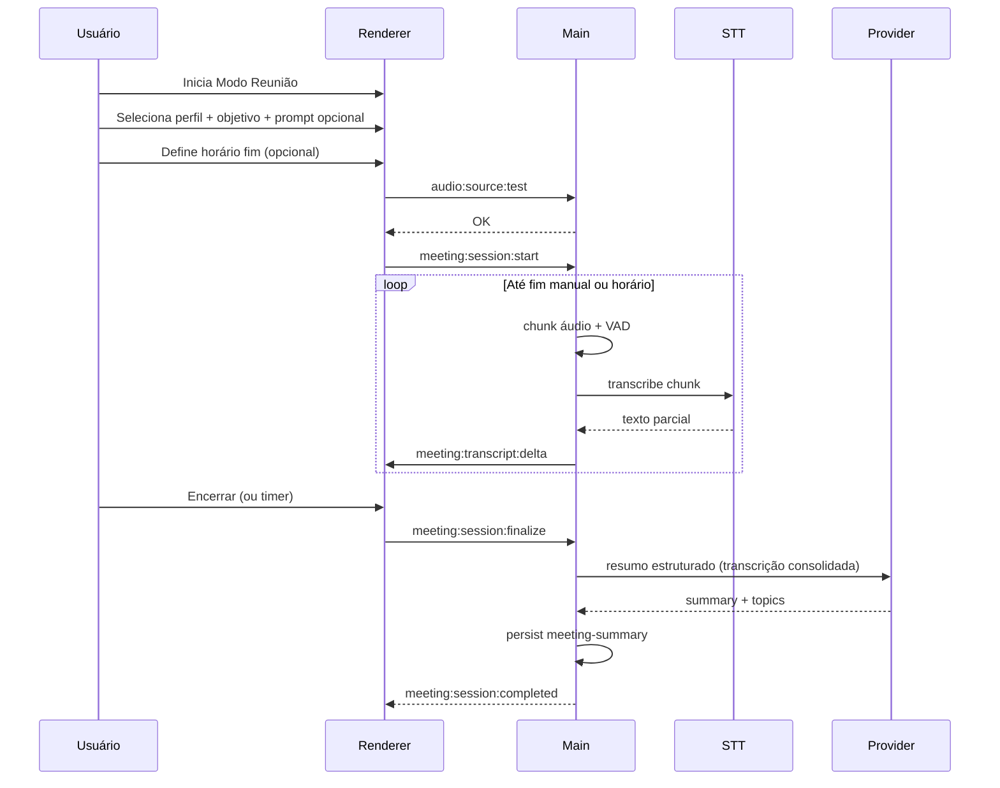
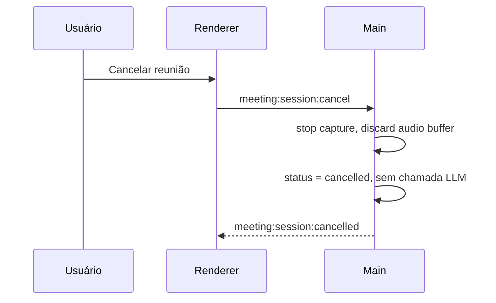

# Plano de funcionalidades — Áudio avançado, modos de reunião e configurações

Documento de planejamento e estruturação para as próximas entregas do **AI Personal Agent** (monorepo `apps/desktop`), considerando o que já existe: captura de microfone, fila de áudio, STT (`stt-adapter` + `whisper-cli`), `ProviderRouter`, Gemini streaming, Settings persistidos, feature flags e stealth.

**Escopo deste documento:** planejamento e arquitetura — não implementação.

---

## 1. Visão geral e ordem recomendada

| Fase | Entrega | Dependências |
|------|---------|--------------|
| **G0** | Infraestrutura de captura (mic / saída / app) + pré-validação + persistência estilo OBS | Epic C parcial |
| **G1** | Configurações unificadas + **multi-provedor LLM** (Gemini, OpenAI, Anthropic) + modelos locais | Settings store, ProviderRouter |
| **G1b** | **Orçamento de tokens** + estimativa em tempo real | G1 |
| **G2** | Modo reunião (observador) + UI gravação/cancelar | G0 + G1 + STT |
| **G3** | Modo reunião ativo (alertas de pergunta) | G0 + G2 (contexto) |
| **G4** | Modo tradução contínua | G0 + STT + tradução |
| **G5** | Polish, testes E2E, stealth em overlays de reunião | Epic D |

**Recomendação:** implementar **G0 → G1** antes dos modos de reunião, pois todos dependem de captura confiável de áudio de reunião (geralmente **saída do sistema** ou **app específico**, não microfone).

---

## 2. Epic G0 — Captura de áudio (estilo OBS)

### 2.1 Objetivo

Permitir que o usuário escolha **como** o áudio é capturado no Windows, salve o perfil e valide a fonte **antes** de iniciar gravação/sessão.

### 2.2 Modos de captura (Windows)

| Modo | Descrição | Uso típico | Complexidade |
|------|-----------|------------|----------------|
| **Microfone** | Já implementado (`getUserMedia` + `selectedAudioInputDeviceId`) | Push-to-talk, ASK com voz | Baixa |
| **Saída do sistema (loopback)** | WASAPI loopback do dispositivo de reprodução padrão ou selecionado | Teams/Meet no alto-falante, qualquer app | Média |
| **Dispositivo de saída específico** | Loopback de um endpoint WASAPI (ex.: “Speakers”, “Headphones”, cabo virtual) | Quando há vários dispositivos | Média |
| **Por aplicativo** | Capturar apenas o áudio de um processo (Teams.exe) | Reunião isolada de outros sons | Alta — **fora do MVP** |

**Avaliação técnica Windows (decisão de produto — §12.2):**

1. **MVP:** apenas **loopback WASAPI** em **Windows 10/11** (saída padrão ou dispositivo escolhido).
2. **Pós-MVP:** captura isolada por processo (Teams.exe); até lá, documentar **cabo virtual** na ajuda.
3. **Implementação sugerida no main process:**
   - Módulo nativo ou processo auxiliar: `ffmpeg` com `dshow`/`wasapi`, ou addon Node (`naudiodon`, `node-audio-capture`, wrapper WASAPI).
   - **Não** depender só de `desktopCapturer` do Electron para áudio de app — suporte inconsistente para loopback puro.

### 2.3 UX (paridade OBS — simplificada)

Painel **Áudio → Fonte de captura**:

- Tipo: `Microfone` | `Saída do sistema` | `Dispositivo de saída` (MVP). `Aplicativo` — UI desabilitada com tooltip “em breve”.
- Dropdown de dispositivos / lista de processos com áudio ativo (refresh).
- Botão **Testar fonte** (3–5 s):
  - Grava amostra curta.
  - Calcula RMS / pico.
  - Exibe: `OK` (nível audível), `Silêncio`, `Dispositivo indisponível`, `Processo não encontrado`.
- Botão **Salvar como padrão** → persiste em Settings.

### 2.4 Pré-validação antes da gravação

Fluxo obrigatório ao **Iniciar sessão** (reunião / tradução / ativo):

```
listar fontes → usuário seleciona → testar → se OK → iniciar pipeline
                  ↘ se falha → mensagem acionável (sem iniciar gravação)
```

Códigos de erro sugeridos: `AUDIO_SOURCE_SILENT`, `AUDIO_DEVICE_BUSY`, `AUDIO_APP_NOT_RUNNING`, `AUDIO_PERMISSION_DENIED`.

### 2.5 Modelo de dados (Settings + `packages/shared-types`)

```ts
// packages/shared-types — extensão proposta
type AudioCaptureMode = "microphone" | "system_loopback" | "output_device" | "application";

interface AudioCaptureProfile {
  mode: AudioCaptureMode;
  deviceId?: string;           // mic ou output endpoint
  applicationId?: string;      // exe / pid estável quando mode === application
  sampleRate: 16000 | 48000;
  channelCount: 1 | 2;
  preRollValidationSeconds: number; // default 3
}

interface AppSettings {
  // ... existente
  audioCapture: AudioCaptureProfile;
  audioCaptureProfiles?: AudioCaptureProfile[]; // presets nomeados (opcional fase 2)
  activeAudioCaptureProfileId?: string;
}
```

### 2.6 Serviços (main process)

| Serviço | Responsabilidade |
|---------|------------------|
| `AudioSourceEnumerator` | Lista mics, outputs WASAPI, processos (quando suportado) |
| `AudioCaptureService` | Abre stream, chunking, VAD (reutilizar lógica Epic C) |
| `AudioSourceValidator` | Teste curto + diagnóstico |
| `AudioCaptureProfileStore` | Leitura/escrita via `settings-store` |

IPC novos (exemplos): `audio:sources:list`, `audio:source:test`, `audio:session:start`, `audio:session:stop`, `audio:session:chunk` (evento para renderer).

---

## 3. Epic G1 — Configurações unificadas (migrar environment)

### 3.1 Objetivo

Centralizar no painel **Configurações** tudo que hoje está em **Feature flags e ambiente** + variáveis `.env`, mantendo override por env **apenas no boot** (comportamento atual documentado no README).

### 3.2 Itens a migrar para UI persistida

| Campo | Origem atual | Persistência |
|-------|--------------|--------------|
| `providerMode` | feature flags + env | `settings.featureFlags` (já existe) |
| `localProviderEnabled` | idem | idem |
| `forceLocalOnly` | idem | idem |
| `stealthHardening` | idem | idem |
| Provedores cloud + modelos | env / só Gemini hoje | `settings.llmProviders` — ver **§3.6** |
| Modelo STT / idioma STT | env / implícito | `settings.models.sttModel`, `settings.sttLanguage` |
| Runtime LLM local | env `LLAMA_*` + ModelManager | `settings.localLlm` — download, path, modelo ativo — ver **§3.7** |
| Orçamento de tokens | — | `settings.tokenBudget` — ver **§3.8** |
| Nível de log | env + diagnóstico | manter em Diagnóstico ou espelhar em Configurações avançadas |

### 3.3 Regras de precedência (documentar na UI)

1. Variáveis de ambiente no **boot** sobrescrevem valores salvos (somente leitura na UI: badge “definido por ambiente”).
2. Alterações na UI aplicam-se após salvar; algumas exigem **reinício** (ex.: `GEMINI_MODEL` se carregado só no boot) — indicar claramente.

### 3.4 Estrutura UI

- **Configurações → Geral:** idioma, atalhos.
- **Configurações → Provedores de IA:** cards por provedor (Gemini, OpenAI, Anthropic), API key, modelo padrão, teste de conexão.
- **Configurações → Modelos locais:** download, validação SHA, start/stop llama-server, modelo ativo.
- **Configurações → Uso por recurso:** qual provedor+modelo usar em ASK, reunião (resumo), reunião ativo (classificador), tradução.
- **Configurações → Orçamento de tokens:** limites, alertas, comportamento ao estourar — §3.8.
- **Configurações → Áudio:** perfil de captura (G0).
- **Configurações → Privacidade:** `forceLocalOnly`, `retentionDays`, `allowCloudProcessingForMeetings` (§12.1), consentimento, purge.
- **Memória do time:** listagem, edição e exclusão de registros agregados.
- Remover ou reduzir painel “Feature flags e ambiente” a **somente leitura** de env ativo (debug).

### 3.5 Tarefas (G1)

- [ ] Estender `settings-store.cjs` e tipos em `ipc.ts`.
- [ ] `env-config.cjs`: expor quais chaves vieram de env vs arquivo.
- [ ] Refatorar `App.tsx` — Configurações com seções acima.
- [ ] Atualizar README e `.env.example`.

### 3.6 Multi-provedor LLM (cloud)

**Decisão:** suportar inicialmente **Gemini**, **OpenAI** e **Anthropic**, cada um com **lista de modelos selecionável** e API key própria (criptografada no main, como Gemini hoje).

**Abstração (evoluir `ProviderRouter` → `LlmProviderRegistry`):**

```ts
type LlmCloudProviderId = "gemini" | "openai" | "anthropic";

interface LlmProviderConfig {
  enabled: boolean;
  apiKeyEncrypted: string;
  defaultModelId: string;           // ex.: gemini-2.5-flash, gpt-4o-mini, claude-3-5-haiku-latest
  availableModels: string[];        // cache da UI ou lista curada + campo custom
}

interface LlmRoutingConfig {
  ask: { providerId: LlmCloudProviderId | "local"; modelId: string };
  meetingSummary: { providerId: LlmCloudProviderId | "local"; modelId: string };
  meetingActiveClassifier: { providerId: LlmCloudProviderId | "local"; modelId: string };
  translation: { providerId: LlmCloudProviderId | "local"; modelId: string };
}

interface AppSettings {
  llmProviders: Record<LlmCloudProviderId, LlmProviderConfig>;
  llmRouting: LlmRoutingConfig;
  activeCloudProviderId?: LlmCloudProviderId; // fallback global se rota não definida
}
```

**Implementação por fase:**

| Fase | Entrega |
|------|---------|
| G1.1 | Interface `LlmProvider` + refatorar `GeminiProvider` |
| G1.2 | `OpenAiProvider` (Chat Completions / Responses API streaming) |
| G1.3 | `AnthropicProvider` (Messages API streaming) |
| G1.4 | UI: card por provedor, dropdown de modelos, botão “Testar API” |
| G1.5 | Roteamento por recurso (`llmRouting`) + migração ASK existente |

**Lista de modelos (MVP — editável + campo “modelo customizado”):**

| Provedor | Modelos sugeridos no dropdown |
|----------|-------------------------------|
| Gemini | `gemini-2.5-flash`, `gemini-2.5-flash-lite`, `gemini-2.5-pro` |
| OpenAI | `gpt-4o-mini`, `gpt-4o`, `o4-mini` (atualizar conforme catálogo) |
| Anthropic | `claude-3-5-haiku-latest`, `claude-sonnet-4-20250514` (atualizar conforme catálogo) |

**Reuniões:** por padrão usar modelo **mais barato/rápido** na rota `meetingSummary`; permitir override na sessão.

### 3.7 LLM local (download e execução)

Reutilizar e expor na UI o que já existe (`llama-server manager`, `ModelManager`):

| Função na UI | Comportamento |
|--------------|---------------|
| Status do runtime | Binário encontrado? Servidor rodando? Porta? |
| Catálogo de modelos | Lista com nome, tamanho, URL (env ou built-in catalog JSON) |
| Baixar modelo | Progress bar; validação SHA-256; bloqueio se `forceLocalOnly` sem URL local |
| Selecionar modelo ativo | Path em `userData/runtime/models` |
| Iniciar / parar servidor | Com auto-tune existente |
| Teste rápido | Prompt fixo “ping” → resposta em &lt; N s |

```ts
interface LocalLlmSettings {
  activeModelId: string;
  installedModels: { id: string; path: string; sha256?: string; sizeBytes: number }[];
  serverPort: number;
  autoStartOnBoot: boolean;
}
```

Rota `llmRouting.*.providerId = "local"` usa `LocalProvider` + modelo ativo.

### 3.8 Orçamento e consumo de tokens

**Princípio:** o usuário deve **ver** o custo antes e durante operações caras (reunião longa, resumo final, modo ativo frequente).

**Persistência:**

```ts
interface TokenBudgetSettings {
  enabled: boolean;
  dailyLimitTokens?: number;      // opcional, cloud agregado
  sessionWarningTokens: number;   // ex.: 50_000 — amarelo na UI de reunião
  sessionHardLimitTokens?: number; // ex.: 200_000 — bloquear nova chamada LLM
  onLimitReached: "warn" | "block_cloud" | "switch_to_local";
}

interface TokenUsageRecord {
  sessionId: string;
  providerId: string;
  modelId: string;
  feature: "ask" | "meeting_summary" | "meeting_active" | "translation";
  inputTokens: number;
  outputTokens: number;
  estimated: boolean;             // true se provider não retornou usage
  atIso: string;
}
```

**Estimativa em tempo real (quando API não devolve usage no stream):**

- Contador aproximado: `chars / 4` no transcript acumulado + prompt de sistema.
- Exibir na barra de reunião: `~12.4k tokens estimados (nuvem)`.

**Durante a reunião (G2/G3):**

- STT local **não** conta para limite cloud.
- Chamadas LLM (resumo incremental, classificador ativo) incrementam contador e disparam alerta ao cruzar `sessionWarningTokens`.

**IPC:** `usage:tokens:get-session`, `usage:tokens:get-daily`, evento `usage:tokens:threshold`.

---

## 4. Epic G2 — Modo reunião (observador)

### 4.1 Objetivo

Escutar a reunião **sem intervir**, gerar ao final um **resumo objetivo** e **atualizar contextos** para uso futuro. Foco: daily, review, planning.

### 4.2 Modelo de contexto (recomendação)

Usar **dois níveis** — não um único blob:

| Tipo | ID sugerido | Conteúdo | Ciclo de vida |
|------|-------------|----------|---------------|
| **Perfil do usuário** | `user-profile` | Função, papel no time, time, responsabilidades, stack, preferências de comunicação | Editável pelo usuário + enriquecido pela LLM (opt-in) |
| **Contexto de reunião (pré)** | `meeting-session` | Objetivo informado, prompt específico, participantes conhecidos, perfil linkado | Criado ao iniciar sessão |
| **Resumo pós-reunião** | `meeting-summary` | Tópicos, decisões, riscos, ações, quem faz o quê, blockers | Gerado ao encerrar; salvo em histórico |

**Por que separar:** o perfil muda pouco e reduz tokens em toda reunião; o resumo de uma daily não deve sobrescrever o perfil, apenas alimentar memória de **time/projeto** (opcional: terceiro nível `team-memory` agregando N resumos — fase posterior).

### 4.3 Fluxo do usuário



**Fluxo alternativo — cancelar sem gastar tokens:**



### 4.3.1 UI durante a gravação (obrigatória)

Barra fixa ou painel **sempre visível** fora do stealth (no stealth: apenas bandeja/tray — §12.3):

| Elemento | Comportamento |
|----------|----------------|
| Indicador **GRAVANDO** | Ícone vermelho pulsante + texto “Gravando reunião” |
| **Cronômetro** | `MM:SS` desde `startedAt`, atualizado a cada segundo |
| **Tokens estimados** | `~Xk tokens (nuvem)` se cloud ativa; “Local — sem tokens cloud” se só local |
| **Encerrar e analisar** | Para captura → STT final → LLM resumo (gasta tokens) |
| **Cancelar reunião** | Confirmação: “Nada relevante foi capturado? Nenhum resumo será gerado e tokens de LLM não serão usados.” → descarta buffers |

Estados da sessão: `recording` | `processing` | `completed` | `cancelled` | `failed`.

Atalho opcional: `Ctrl+Shift+C` cancelar, `Ctrl+Shift+E` encerrar e analisar (configurável).

### 4.4 Otimização de tokens

| Técnica | Quando |
|---------|--------|
| STT local (Whisper) | `hybrid` / `local` — transcrição não consome tokens Gemini |
| Chunks com VAD | Já existe no Epic C — evitar silêncio |
| **Resumo incremental** a cada N minutos (local ou modelo barato) | Reuniões > 30 min — LLM final recebe resumos, não transcript bruto |
| Aceleração de áudio 1.25x–1.5x antes do STT | Opcional configurável; validar qualidade PT/EN |
| Prompt de saída estruturado (JSON) | Tópicos, críticos, ações — resposta curta |
| Limite de transcript enviado ao LLM | Ex.: últimos 8k tokens + resumos intermediários |
| **Cancelar sessão** | Zero chamada LLM; apagar áudio temporário da sessão |
| Orçamento por sessão | Alerta amarelo / bloqueio conforme §3.8 |
| Modelo barato na rota `meetingSummary` | Default: flash/haiku/mini por provedor |

### 4.5 Saída esperada (pós-reunião)

- **Resumo executivo** (5–10 linhas).
- **Tópicos discutidos** (bullets).
- **Pontos críticos / riscos**.
- **Action items** (responsável se detectável).
- **Sugestão de atualização** ao perfil/time-memory (usuário aprova antes de merge).

### 4.6 Persistência

- SQLite ou JSON em `userData/contexts/` (MVP: JSON versionado).
- Entidades: `UserProfile`, `MeetingSession`, `MeetingSummary`.
- Export opcional Markdown.

### 4.7 Integração stealth

- Durante reunião **fora do stealth**: barra completa §4.3.1.
- **Stealth ativo:** sem barra na UI compartilhável; **tray icon** com tooltip “Gravando · 12:34” e menu Encerrar / Cancelar; **zero** notificação sonora ou toast.
- Transcript detalhado suprimido em stealth `strict` (comportamento atual do produto).

---

## 5. Epic G3 — Modo reunião ativo (copiloto)

### 5.1 Objetivo

Usuário **pouco atento** à reunião; o sistema monitora o áudio da reunião (Teams, etc.) e alerta quando alguém **parece dirigir pergunta ao usuário**, sugerindo resposta rápida.

### 5.2 Diferença em relação ao modo observador

| Aspecto | Modo reunião | Modo reunião ativo |
|---------|--------------|-------------------|
| Latência LLM | Baixa — processamento ao fim | **Alta prioridade em tempo real** |
| STT | Batch/chunks | Streaming contínuo |
| LLM | Um shot final | Classificação + sugestão por evento |
| UI | Resumo pós | **Alerta modal/toast** + painel de pergunta/resposta |

### 5.3 Pipeline em tempo real

1. Captura loopback (G0) — mesma fonte que Teams.
2. STT incremental (janelas 2–4 s com overlap).
3. **Detector de pergunta dirigida** (camadas):
   - **Heurística:** contém `?`; padrões “[Nome], você…”, “what do you think”, “pode falar”, “sua opinião”; nome/apelido do usuário (configurável).
   - **Classificador LLM leve** (rota `meetingActiveClassifier` — modelo rápido/barato): entrada = últimos 30–60 s de transcript + metadata; saída = `{ directedToUser: boolean, questionText, confidence }`.
   - Respeitar `tokenBudget` — em limite, só heurística sem LLM.
4. Se `confidence >= limiar` → notificação + sugestão de resposta (2–4 frases objetivas).
5. Usuário pode copiar, descartar ou marcar “falso positivo” (feedback para tuning).

### 5.4 Configuração pré-sessão

- Nome completo e apelidos (lista).
- Contexto da reunião (reutiliza `meeting-session`).
- Perfil do usuário (G2).
- Opcional: lista de participantes e quem **não** é o usuário (reduz falsos positivos).

### 5.5 Pós-reunião

- Diálogo: “Salvar resumo simplificado?” → se sim, gera `meeting-summary` enxuto (sem duplicar pipeline completo do modo observador se já rodou classificador).

### 5.6 Riscos

| Risco | Mitigação |
|-------|-----------|
| Falso positivo | Limiar + confirmação visual; modo “só alerta com ?” |
| Latência > 5 s | Modelo rápido; STT local; janela menor |
| Privacidade | Toggle cloud por sessão + `forceLocalOnly`; disclaimer §12.7 |
| Stealth | **Sem notificação** em stealth; fila de alertas consultável ao desativar stealth |

---

## 6. Epic G4 — Modo tradução contínua

### 6.1 Objetivo

Capturar áudio de uma saída, detectar idioma de origem (ou fixo), traduzir para idioma alvo e exibir **legendas em tempo quase real**.

### 6.2 Fluxo

```
loopback → STT (idioma origem) → tradução → UI overlay
```

### 6.3 Provedores de tradução

| Modo | Provedor | Latência | Privacidade |
|------|----------|----------|-------------|
| Cloud | Provedor configurado em `llmRouting.translation` ou Translate API dedicada | Menor | Dados saem da máquina |
| Local | Modelo NLLB / Marian via runtime local | Maior | Melhor para `forceLocalOnly` |

Roteamento via `ProviderRouter` (mesmo padrão STT/ASK).

### 6.4 UX

- Seleção: fonte de áudio (G0), idioma origem (`auto` | fixo), idioma destino.
- Overlay sempre no topo (opacidade, tamanho fonte, histórico últimas N linhas).
- Métrica na UI: latência média últimos 30 s.

### 6.5 Meta de performance

- Primeira legenda: < 3 s após fala audível (cloud, rede normal).
- Atualização contínua a cada chunk STT (1–2 s).

---

## 7. Arquitetura de módulos (alvo)

```
apps/desktop/electron/
  audio-source-enumerator.cjs      # G0
  audio-capture-service.cjs        # G0
  audio-source-validator.cjs       # G0
  llm-provider-registry.cjs        # G1 — gemini | openai | anthropic | local
  providers/
    gemini-provider.cjs            # refatorar
    openai-provider.cjs            # G1.2
    anthropic-provider.cjs         # G1.3
  token-usage-tracker.cjs          # G1b
  meeting-session-orchestrator.cjs # G2, G3
  translation-pipeline.cjs         # G4
  context-store.cjs                # perfis + resumos + team-memory

packages/core-domain/
  meeting.ts
  audio-capture.ts
  user-profile.ts
  llm-provider.ts
  token-usage.ts

packages/shared-types/
  ipc.ts                           # novos canais meeting:*, audio:*

apps/desktop/src/
  features/
    settings/                      # G1
    audio-capture/                 # G0 UI teste fonte
    meeting-passive/               # G2
    meeting-active/                # G3
    live-translation/              # G4
```

**Orquestrador central:** `SessionOrchestrator` (citado no plano original) coordena estado `idle | meeting_passive | meeting_active | translating | ask`.

---

## 8. Contratos IPC propostos (resumo)

| Canal | Direção | Uso |
|-------|---------|-----|
| `audio:sources:list` | invoke | Lista fontes |
| `audio:source:test` | invoke | Pré-validação |
| `audio:session:start` | invoke | Inicia captura modo X |
| `audio:session:stop` | invoke | Para captura |
| `audio:chunk` | event → renderer | Chunks para debug/VAD |
| `meeting:session:start` | invoke | profileId, objective, prompt, endAtIso, useCloud |
| `meeting:session:stop` | invoke | Finaliza e dispara resumo |
| `meeting:session:cancel` | invoke | Cancela sem LLM; descarta buffers |
| `meeting:session:status` | event | recording \| processing \| completed \| cancelled + elapsedSec |
| `meeting:transcript:delta` | event | Texto parcial |
| `meeting:session:completed` | event | Summary pronto |
| `meeting:session:cancelled` | event | Sessão descartada |
| `usage:tokens:session` | invoke/event | Estimativa e totais da sessão |
| `llm:providers:test` | invoke | Testa API key + modelo por provedor |
| `llm:local:download` | invoke | Progresso download modelo |
| `meeting:active:alert` | event | Pergunta detectada + sugestão |
| `translation:session:start/stop` | invoke | G4 |
| `translation:line` | event | Linha traduzida |
| `context:profiles:list/save` | invoke | Perfis usuário |
| `context:meetings:list` | invoke | Histórico resumos |

---

## 9. ADRs sugeridos (antes de codar G0/G3)

| ADR | Tema |
|-----|------|
| ADR-006 | Captura de áudio Windows (WASAPI vs virtual cable vs app-specific) |
| ADR-007 | Modelo de contexto (perfil vs reunião vs team-memory) |
| ADR-008 | Detecção de pergunta dirigida (heurística vs LLM vs híbrido) |
| ADR-009 | Retenção e purge de transcrições de reunião (LGPD/privacidade) |
| ADR-010 | Abstração multi-provedor LLM (interface, streaming, usage) |
| ADR-011 | Estimativa de tokens e limites por sessão |

---

## 10. Critérios de aceite por epic

### G0
- Usuário salva perfil “Teams - Speakers” e reinicia app com mesma seleção.
- Teste de fonte bloqueia início se silêncio total.
- Documentação de limitação “captura por app” no Windows.

### G1
- Três provedores cloud configuráveis com API key, modelo e teste de conexão.
- Roteamento independente ASK vs reunião vs ativo vs tradução.
- UI de modelos locais: download, seleção, start/stop llama-server.
- Painel antigo de env reduzido ou removido.

### G1b
- Barra de reunião mostra tokens estimados; alerta ao atingir limite configurado.
- Histórico de uso por sessão persistido localmente.

### G2
- Barra **GRAVANDO** + cronômetro MM:SS visíveis durante sessão.
- **Cancelar reunião** não dispara LLM e remove áudio temporário.
- **Encerrar e analisar** gera resumo; sessão 15 min em modelo “flash/mini” < 2 min após encerrar.
- Perfil carregado + timer de fim automático.

### G3
- Em cenário de teste gravado, detecta pergunta com nome do usuário em < 8 s.
- Sugestão de resposta exibida em overlay.
- Opt-in pós-reunião para salvar resumo.

### G4
- Legenda em PT a partir de áudio EN com latência média documentada.
- Funciona com fonte loopback Teams.

---

## 11. Ideias adicionais (backlog)

1. **Action items → integração** (export CSV, webhook, futuro Linear/Jira).
2. **Templates de reunião** (daily, retro, 1:1) com prompts pré-definidos.
3. **Participantes por voz** (diarização simples — “Speaker 1” — fase avançada).
4. **Modo “só notas”** — sem gravar áudio; usuário cola notas e LLM estrutura (zero captura).
5. **Resumo durante reunião** — botão “o que importa até agora?” sem encerrar.
6. **Sincronização opcional** de perfis entre máquinas (criptografado, opt-in).
7. **Hotkey global** “marcar momento importante” com timestamp no transcript.
8. **Compatibilidade com stealth** — overlay de tradução/alerta em janela filha excluída do share (validar na matriz Zoom/Teams).
9. **Modo híbrido reunião** — observador + alerta ativo na mesma sessão (unificar G2+G3).
10. **Quality gate beta** — métricas de falsos positivos no modo ativo com pilotos.

---

## 12. Decisões de produto (fechadas)

| # | Pergunta | Decisão |
|---|----------|---------|
| 1 | Plataforma | **Apenas Windows 10 e 11** na primeira entrega de captura loopback e modos de reunião. |
| 2 | Privacidade / nuvem | **Fechado** — §12.1 (toggle Config + checkbox por sessão). |
| 11 | Multi-provedor LLM | **Gemini, OpenAI, Anthropic** + modelos locais — §3.6–3.7. |
| 12 | Tokens / cancelar | Orçamento §3.8; cancelar reunião §4.3.1; UI gravação obrigatória. |
| 3 | Retenção | **7 dias** para áudio bruto, transcrições e resumos; **configurável** em Configurações (ex.: 1–30 dias). Purge automático no main process. |
| 4 | Captura por app | Ver **§12.2**. **MVP: loopback** (saída do sistema/dispositivo). Captura isolada por app **fora do MVP**. |
| 5 | Modo ativo + stealth | **Somente alertas visuais** no modo normal. Em **stealth: zero notificação** (nem som, nem toast, nem overlay intrusivo) — ver §12.3. |
| 6 | Tradução MVP | **Somente PT ↔ EN**. |
| 7 | Perfis | **Vários perfis**; defaults iniciais: **Gerente de projeto** e **Desenvolvedor**. Usuário cria/edita/duplica. |
| 8 | Team-memory | **Agregação automática** após cada reunião. Módulo **Memória do time** na UI: listar, abrir, editar e **excluir** registros. |
| 9 | Calendário | **Sim**, se viável: **Google Calendar** e **Microsoft 365 / Teams calendar** (Graph API) para pré-preencher título, horário fim e link. |
| 10 | Compliance | **Disclaimer obrigatório** antes da primeira gravação e checkbox por sessão (“participantes foram informados / gravação permitida”). |

### 12.1 O que é “opt-in” de privacidade (pergunta 2)

**Opt-in** = o usuário precisa **marcar explicitamente** algo do tipo “Enviar áudio/transcrição para processamento na nuvem (Gemini)” **antes** de cada sessão (ou uma vez nas configurações, se preferir persistir a escolha).

**Sem opt-in (padrão cloud)** = ao iniciar modo reunião, o fluxo usa Gemini/STT cloud automaticamente se `providerMode` for `cloud` ou `hybrid`, sem checkbox extra.

| Abordagem | Vantagens | Desvantagens |
|-----------|-----------|--------------|
| **Cloud por padrão** (sem opt-in extra) | Menos cliques; melhor qualidade/latência no MVP; alinhado ao fluxo ASK atual. | Dados da reunião saem da máquina; usuário pode esquecer que está na nuvem; mais sensível em empresa com política de dados. |
| **Opt-in por sessão** | Transparência máxima; adequado se TI exigir consentimento explícito; combina bem com aviso legal (item 10). | Fricção a cada reunião; usuários podem desmarcar e quebrar qualidade; mais estados na UI. |
| **Opt-in nas Configurações** (uma vez) | Equilíbrio: escolha consciente sem checkbox toda reunião. | Quem mudou de política pode não rever config; ainda precisa disclaimer por sessão se exigido legalmente. |
| **Padrão local + opt-in cloud** | Melhor privacidade; reforça `forceLocalOnly`. | Whisper/LLM local mais lentos ou piores em hardware fraco; mais suporte. |

**Decisão adotada (produto):**

- **Configurações → Privacidade:** toggle `allowCloudProcessingForMeetings`
  - default **`true`** se `providerMode=cloud`
  - default **`false`** se `providerMode=local` ou `forceLocalOnly=true`
- **Wizard de início da reunião:** checkbox “Processar nesta reunião na nuvem” — **pré-marcado** conforme o toggle; desmarcar usa apenas STT/LLM local (se disponível).
- Disclaimer legal (§12.7) permanece obrigatório independentemente do checkbox.

### 12.2 Captura por aplicativo vs loopback (pergunta 4)

Quando você ouve uma reunião no **Teams**, o som sai pelos **alto-falantes ou fone** do Windows. O app não “entrega” o áudio facilmente para outro programa — o sistema mistura tudo na **saída de áudio**.

**Três formas de capturar esse som:**

```
┌─────────────────────────────────────────────────────────────────┐
│  A) LOOPBACK (MVP — recomendado)                                 │
│  Teams → Windows (dispositivo "Speakers") → App grava ESSA saída │
│  Captura: tudo que sai naquele dispositivo (Teams + notificações)│
└─────────────────────────────────────────────────────────────────┘

┌─────────────────────────────────────────────────────────────────┐
│  B) CABO VIRTUAL (alternativa manual, estilo OBS)                │
│  Teams → configurar saída = "CABLE Input" → App grava o cabo     │
│  Captura: só o que você mandou para o cabo (mais limpo)          │
└─────────────────────────────────────────────────────────────────┘

┌─────────────────────────────────────────────────────────────────┐
│  C) POR APLICATIVO (pós-MVP)                                     │
│  App grava SOMENTE o processo Teams.exe (sem outros sons)        │
│  Exige API nativa Windows / driver — mais complexo               │
└─────────────────────────────────────────────────────────────────┘
```

**Decisão para v1:** implementar **A (loopback WASAPI)** + documentar **B** na ajuda. **C** fica para fase posterior.

Na UI (estilo OBS simplificado), o usuário escolhe:

- **“Saída do sistema (padrão)”** — o que o Windows está reproduzindo agora.
- **“Dispositivo de saída específico”** — ex.: fone USB, ou cabo virtual se instalou o B.

Não prometer no MVP: dropdown “só Microsoft Teams” isolado do resto do sistema.

### 12.3 Stealth e modo reunião ativo (pergunta 5)

| Modo | Comportamento |
|------|----------------|
| Normal | Overlay visual com pergunta + sugestão de resposta; **sem som**. |
| Stealth | **Nenhuma notificação** (sem toast, sem bip, sem overlay visível). Processamento continua em background; usuário consulta alertas **apenas ao sair do stealth** ou por hotkey que abre painel discreto não compartilhado (definir no ADR-004). |

### 12.4 Retenção configurável (pergunta 3)

- Default: **7 dias**.
- Configurações → Privacidade → `retentionDays` (faixa sugerida: 1–30).
- Job diário no main: apagar `userData/audio-captures`, transcripts e opcionalmente áudio bruto de reunião vencidos.
- Resumos agregados em team-memory: mesma política ou **manter resumos** e apagar só áudio bruto — *sugestão:* apagar áudio em 7 dias; manter **texto do resumo** até exclusão manual (usuário pediu módulo para excluir).

### 12.5 Perfis e team-memory (perguntas 7–8)

**Perfis (vários):**

- Seeds: `Gerente de projeto`, `Desenvolvedor`.
- Campos: nome, função, time, responsabilidades, tom de comunicação, prompt base.
- Ao iniciar reunião: dropdown “Atuar como perfil: …”.

**Team-memory (agregação automática):**

- Após cada `meeting-summary`, extrair fatos estáveis (blockers recorrentes, donos de ação, decisões) e **append** em `team-memory` indexado por time/projeto.
- UI **Memória do time**: tabela/cards com data, origem (qual reunião), trecho, botões **Ver / Editar / Excluir** (exclusão remove item sem apagar reunião inteira, salvo ação explícita).

### 12.6 Calendário (pergunta 9)

| Fonte | API | Uso no app |
|-------|-----|------------|
| Google Calendar | Google Calendar API + OAuth | Listar eventos do dia; pré-preencher título como objetivo; `end` como horário fim da gravação. |
| Teams / Outlook | Microsoft Graph (`/me/calendar/events`) + OAuth Azure AD | Idem para reuniões corporativas Teams. |

**Escopo MVP calendário:** somente leitura de eventos próximos + seleção de um evento para preencher wizard (sem criar/editar eventos no calendário).

**Ordem de implementação sugerida:** Google primeiro (OAuth mais simples para piloto) → Microsoft Graph em seguida.

### 12.7 Compliance (pergunta 10)

- Primeira vez que usuário inicia qualquer gravação de reunião: modal com texto legal editável (template PT) + checkbox obrigatório.
- Cada sessão: checkbox “Confirmo que a gravação/análise é permitida neste contexto”.
- Log local: `consentAcceptedAtIso`, versão do texto, `sessionId` (auditoria interna).

### 12.8 Cancelar reunião e indicador de gravação

- **Cancelar:** ação destrutiva com confirmação; estado `cancelled`; sem `meeting-summary`, sem team-memory, sem tokens LLM.
- **Encerrar e analisar:** único caminho que gasta tokens de resumo (salvo resumos incrementais já disparados — configurável: “permitir incremental” on/off).
- **UI:** §4.3.1 — indicador GRAVANDO, cronômetro, tokens estimados, botões Encerrar vs Cancelar.
- **Stealth:** tray com tempo decorrido; Encerrar/Cancelar no menu do tray apenas.

### 12.9 Multi-provedor e modelos locais

- Cloud: **Gemini, OpenAI, Anthropic** — API key + modelo por provedor; roteamento por recurso (§3.6).
- Local: download/validação/execução via UI integrada ao ModelManager e llama-server (§3.7).
- ASK existente migra para `llmRouting.ask` sem quebrar fluxo Gemini atual.

---

## 13. Estimativa grossa (para planejamento)

| Epic | Esforço relativo |
|------|------------------|
| G0 Captura avançada Windows | 2–3 semanas |
| G1 Configurações + multi-provedor + UI local | 2–3 semanas |
| G1b Orçamento de tokens | 3–5 dias |
| G2 Modo reunião + UI gravação/cancelar | 2 semanas |
| G3 Modo reunião ativo | 2–3 semanas |
| G4 Tradução contínua | 1–2 semanas |
| Testes + docs + stealth | 1 semana |

**Total orientativo:** 10–14 semanas sequenciais; paralelizar G1.1 (interface) com G0; G1b com G2.

---

## 14. Próximo passo imediato (sprint sugerido)

1. ADRs pendentes (ADR-006, ADR-010, ADR-011).
2. Backlog: tradução NLLB dedicada; resumo incremental em reuniões longas; content protection validada em Zoom/Teams para overlay.
3. G1: reduzir painel legado de flags editáveis (se ainda existir em fork) — Ambiente já é somente leitura.

### G3 — status de implementação (MVP)

| Item | Status |
|------|--------|
| `meeting-active-detector.cjs` (heurística + prompts) | Feito |
| Integração no `meeting-session-orchestrator.cjs` | Feito |
| IPC `meeting:active:alert` + preload | Feito |
| UI modo ativo / apelidos / painel de alertas | Feito |
| `meetingPrefs` em settings + aba Reunião | Feito |
| IPC `context:team-memory:list/delete` | Feito (sem UI de listagem) |
| Tray stealth durante gravação | Feito (`meeting-tray-service.cjs`) |
| UI Memória do time | Feito (`TeamMemoryPanel` em Config → Reunião) |
| Pré-teste áudio antes da sessão | Feito (`testAudioSource` / getUserMedia) |

### G4 — status de implementação (MVP)

| Item | Status |
|------|--------|
| `translation-session.cjs` (loopback + STT + LLM) | Feito |
| IPC start/stop/status/chunk + evento `translation:line` | Feito |
| `TranslationModePanel` + modo 🌐 no header | Feito |
| Rota `llmRouting.translation` na aba Reunião | Feito |
| Overlay dedicado / janela always-on-top | Feito (`translation-overlay-window.cjs` + `?view=translation-overlay`) |
| Tradução via LLM local (`forceLocalOnly` / sem nuvem) | Feito (`localProvider` no pipeline) |
| Métricas latência (média, pico, linhas) | Feito |

### G3 — refinamentos

| Item | Status |
|------|--------|
| Modo híbrido (resumo + alertas) | Feito (`hybrid`) |
| Falso positivo (`meeting:active:dismiss`) | Feito |

### G5 — polish e testes

| Item | Status |
|------|--------|
| Overlay tradução + `setContentProtection` por stealth | Feito |
| E2E IPC reunião / tradução / env | Feito (`ipc.e2e.test.cjs`) |
| `env-config` catálogo + UI Ambiente | Feito |
| README + `.env.example` modos reunião/tradução | Feito |

### §12 — fechamento parcial (wizard, auditoria, retenção)

| Item | Estado |
|------|--------|
| Wizard 4 passos + templates (`MeetingWizard`, `meeting-templates.cjs`) | Feito |
| Consentimento obrigatório + log (`consent-audit-store.cjs`, IPC `meeting:consent:*`) | Feito |
| Purge retenção 24h (`retention-purge-service.cjs`, `privacy:retention:purge`) | Feito |
| CRUD perfis UI (`ContextProfilesSettings`) | Feito |
| Edição memória do time (`context:team-memory:update`) | Feito |
| Resumo mid-call + bookmark (`meeting:session:mid-summary`, `meeting:transcript:bookmark`) | Feito |
| Export/cópia resumo na UI | Feito |
| `usage:tokens:daily` + evento `usage:tokens:threshold` | Feito |
| Consentimento + log na tradução ao vivo | Feito (`translation-session` + `translation:consent:get`) |
| Calendário, hotkey bookmark, ADRs | Backlog |

---

*Última atualização: §12 parcial (wizard, consent log, purge, perfis, mid-summary); G0–G5 MVP entregues.*
